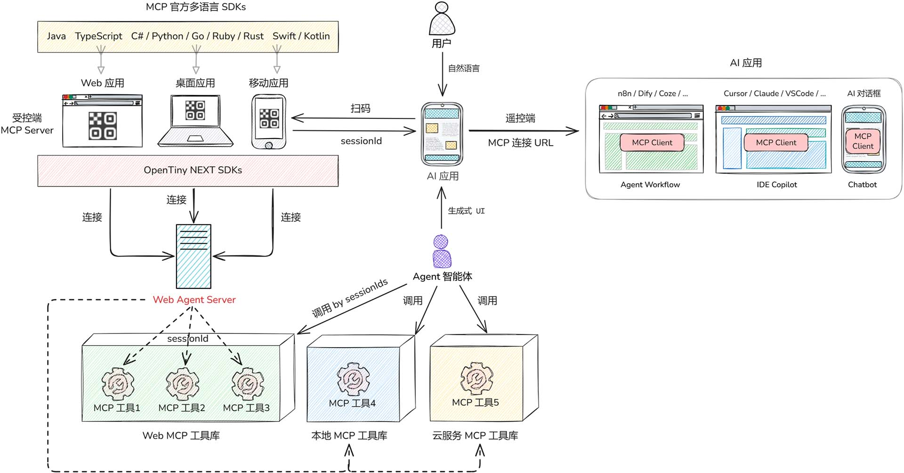

# WebAgent

<p align="center">
  <a href="https://opentiny.design" target="_blank" rel="noopener noreferrer">
    
  </a>
</p>

<p align="center">
  <strong>智能代理中枢服务 - MCP 代理转发解决方案</strong>
</p>

<p align="center">
  <a href="#功能特性">功能特性</a> •
  <a href="#快速开始">快速开始</a> •
  <a href="#项目架构">项目架构</a> •
  <a href="#api-接口">API 接口</a> •
  <a href="#部署指南">部署指南</a> •
  <a href="#贡献指南">贡献指南</a>
</p>

[English](README.md) | 简体中文

[](https://deepwiki.com/opentiny/web-agent)

---

## 概述

WebAgent 是一个开源的智能代理中枢服务，提供 **MCP（Model Context Protocol）** 代理转发核心功能。
它是 OpenTiny NEXT 智能化解决方案的一环，通常与 `@opentiny/next-sdk` 搭配使用：业务应用通过 SDK 将能力封装为 MCP 工具并连接 WebAgent，由 WebAgent 负责连接、转发与会话管理，使 AI/Agent 能以自然语言驱动应用。
如需了解更完整的生态与角色定位，请参阅

- [Opentiny 官网](https://opentiny.design/)
- [一场 MCP 生态的变革——详解 OpenTiny NEXT 逆向思维的技术创新](https://mp.weixin.qq.com/s/xMx5sfKGh2R-oZPGUwv70A)。



## 功能特性

- 🔄 **MCP 代理转发**：完整支持 Model Context Protocol 代理转发
- 📡 **SSE 连接管理**：支持 Server-Sent Events 实时通信
- 🌐 **Streamable HTTP**：支持流式 HTTP 请求处理
- 🏥 **健康检查**：完善的健康检查接口，便于监控和运维
- 🔒 **安全中间件**：内置 CORS、Helmet 等安全中间件
- 📝 **完善日志**：基于 Winston 的日志系统，支持敏感信息脱敏
- 🚀 **生产就绪**：支持 PM2 进程管理，适合生产环境部署

## 快速开始

### 环境要求

- **Node.js**: >= 22.0.0
- **pnpm**: >= 10（推荐）

### 安装依赖

```bash
# 克隆仓库
git clone https://github.com/opentiny/web-agent.git
cd web-agent

# 安装依赖
pnpm install
```

### 配置环境变量

复制示例配置文件并根据需要修改：

```bash
cp example.env .env
```

环境变量说明：

| 变量名        | 说明                     | 默认值                  |
| ------------- | ------------------------ | ----------------------- |
| `AGENT_PORT`  | 服务监听端口             | `3000`                  |
| `AGENT_HOST`  | 监听地址                 | `0.0.0.0`               |
| `NODE_ENV`    | 运行环境                 | `development`           |
| `CORS_ORIGIN` | 跨域来源列表（逗号分隔） | `http://localhost:3000` |

说明：`example.env` 默认设置 `NODE_ENV=production`，本地开发可将 `.env` 修改为 `development`。

### 启动服务

```bash
# 开发模式（热重载）
pnpm dev

# 构建生产版本
pnpm build

# 生产模式运行（需先构建 dist）
pnpm start

# 使用 PM2 运行
pnpm pm2:start
```

## 项目架构

```
web-agent/
├── src/
│   ├── app.ts                 # 应用主入口
│   ├── server.ts              # 服务器启动文件
│   ├── Logger.ts              # Winston 日志配置
│   ├── config/
│   │   ├── index.ts           # 应用配置
│   │   └── logger.ts          # 日志配置
│   ├── middleware/
│   │   ├── index.ts           # 中间件统一入口
│   │   ├── corsMiddleware.ts  # CORS 跨域处理
│   │   ├── errorMiddleware.ts # 错误处理
│   │   ├── loggingMiddleware.ts   # 请求日志
│   │   ├── requestIdMiddleware.ts # 请求 ID
│   │   ├── securityMiddleware.ts  # 安全头
│   │   └── validationMiddleware.ts # 请求验证
│   ├── routes/
│   │   ├── index.ts           # 路由统一入口
│   │   ├── health.ts          # 健康检查路由
│   │   └── v1/
│   │       ├── index.ts       # v1 API 路由入口
│   │       └── webmcp.ts      # MCP 代理路由
│   └── utils/
│       └── ...                # 工具函数
├── ecosystem.config.cjs       # PM2 配置
├── example.env                # 环境变量示例
├── package.json
└── tsconfig.json
```

### 核心模块说明

- **MCP 代理模块** (`routes/v1/webmcp.ts`)：核心功能模块，处理 MCP 协议的代理转发，支持 SSE 和 Streamable HTTP 两种传输方式
- **中间件层** (`middleware/`)：提供完整的请求处理管道，包括安全、日志、验证等
- **配置模块** (`config/`)：集中管理应用配置，支持环境变量覆盖

## API 接口

### 健康检查

| 端点               | 方法 | 说明                             |
| ------------------ | ---- | -------------------------------- |
| `/health`          | GET  | 获取系统状态和版本信息           |
| `/health/detailed` | GET  | 获取详细健康状态（内存、CPU 等） |
| `/health/metrics`  | GET  | 获取性能指标                     |

### MCP 代理接口

所有 MCP 相关接口均以 `/api/v1/webmcp` 为前缀：

| 端点                      | 方法 | 说明                     |
| ------------------------- | ---- | ------------------------ |
| `/api/v1/webmcp/ping`     | GET  | 连接测试                 |
| `/api/v1/webmcp/sse`      | GET  | SSE 连接端点             |
| `/api/v1/webmcp/messages` | POST | 消息转发端点             |
| `/api/v1/webmcp/mcp`      | ALL  | Streamable HTTP MCP 端点 |
| `/api/v1/webmcp/list`     | GET  | 获取所有客户端会话       |
| `/api/v1/webmcp/remoter`  | GET  | 获取所有操控端会话       |
| `/api/v1/webmcp/tools`    | GET  | 获取客户端工具列表       |
| `/api/v1/webmcp/client`   | GET  | 查询单个客户端信息       |
| `/api/v1/webmcp/reset`    | GET  | 重置所有连接             |

### 使用 MCP Inspector 调试

可以使用 MCP Inspector 工具连接进行调试：

```
# SSE 模式
http://localhost:3000/api/v1/webmcp/sse?sessionId=<your-session-id>

# Streamable HTTP 模式
http://localhost:3000/api/v1/webmcp/mcp?sessionId=<your-session-id>
```

## 部署指南

### 开发环境

```bash
# 使用 nodemon 热重载
pnpm dev
```

### 生产环境

#### 使用 PM2（推荐）

```bash
# 启动
pnpm pm2:start

# 查看状态
pm2 status

# 查看日志
pnpm pm2:logs

# 停止
pnpm pm2:stop

# 重启
pnpm pm2:restart

# 删除
pnpm pm2:delete
```

#### 使用 Docker

```dockerfile
FROM node:22-alpine

WORKDIR /app
COPY package.json pnpm-lock.yaml ./
RUN corepack enable && pnpm install --frozen-lockfile --prod

COPY dist ./dist

ENV NODE_ENV=production
ENV AGENT_PORT=3000
ENV AGENT_HOST=0.0.0.0

EXPOSE 3000

CMD ["node", "dist/server.js"]
```

说明：该 Dockerfile 假设你已在本地执行 `pnpm build` 生成 `dist` 后再 `docker build`。
若仓库不包含 `pnpm-lock.yaml`，请移除 `COPY pnpm-lock.yaml ./` 以及 `--frozen-lockfile` 参数。

### Nginx 反向代理配置示例

```nginx
upstream webagent {
    server 127.0.0.1:3000;
}

server {
    listen 80;
    server_name your-domain.com;

    location / {
        proxy_pass http://webagent;
        proxy_http_version 1.1;
        proxy_set_header Upgrade $http_upgrade;
        proxy_set_header Connection 'upgrade';
        proxy_set_header Host $host;
        proxy_set_header X-Real-IP $remote_addr;
        proxy_set_header X-Forwarded-For $proxy_add_x_forwarded_for;
        proxy_set_header X-Forwarded-Proto $scheme;
        proxy_cache_bypass $http_upgrade;

        # SSE 支持
        proxy_buffering off;
        proxy_read_timeout 86400;
    }
}
```

## 配置说明

### PM2 配置

项目提供 `ecosystem.config.cjs` 配置文件：

- 单实例 Fork 模式
- 内存超过 1G 自动重启
- 日志文件自动管理
- 优雅停机支持

## 开发指南

### 脚本命令

```bash
pnpm dev          # 开发模式运行
pnpm build        # 构建生产版本
pnpm start        # 运行生产版本
pnpm lint         # 代码检查
pnpm lint:fix     # 自动修复
pnpm format       # 格式化代码
pnpm format:check # 检查格式
```

### 代码规范

- 使用 ESLint + Prettier 进行代码规范
- TypeScript 严格模式
- 遵循 Express.js 最佳实践

## 贡献指南

请使用独立贡献指南：

- 中文版：[CONTRIBUTING.zh-CN.md](./CONTRIBUTING.zh-CN.md)
- English: [CONTRIBUTING.md](./CONTRIBUTING.md)

## 相关链接

- [MCP 协议规范](https://modelcontextprotocol.io/)
- [OpenTiny 官网](https://opentiny.design/)
