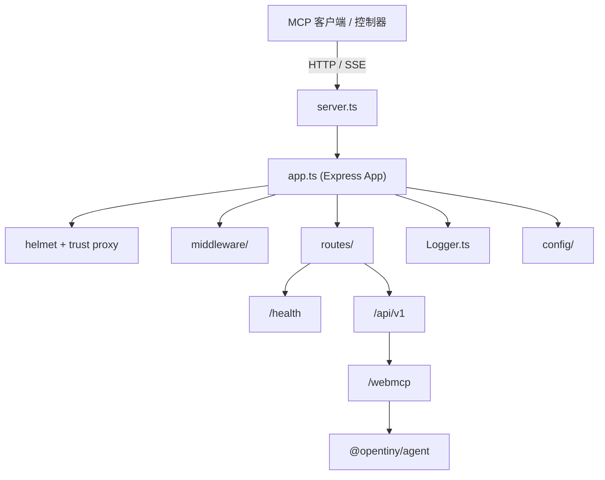
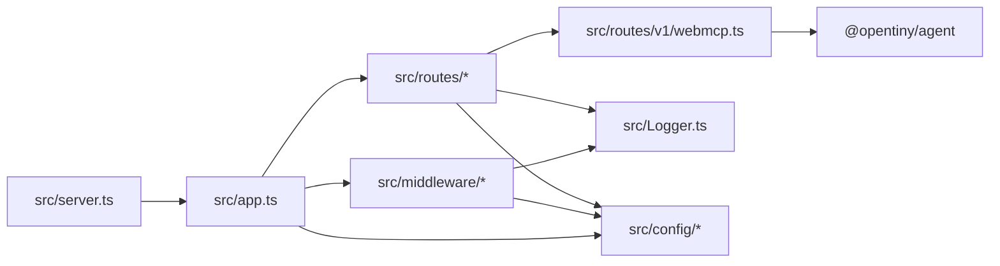
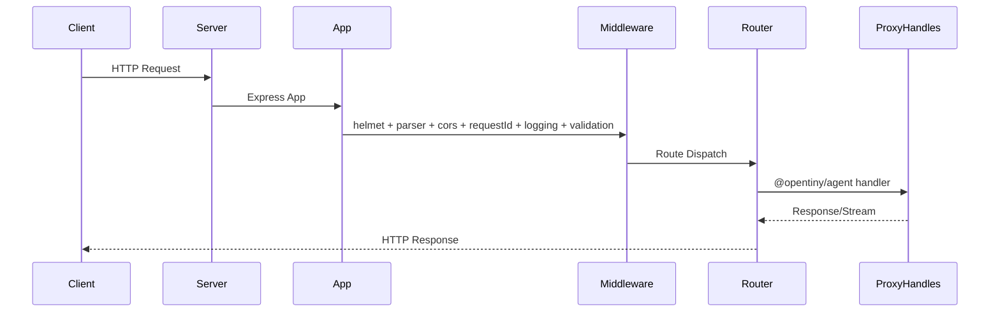
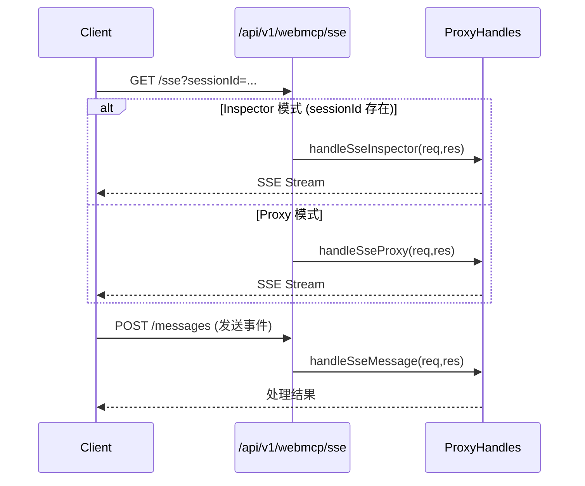
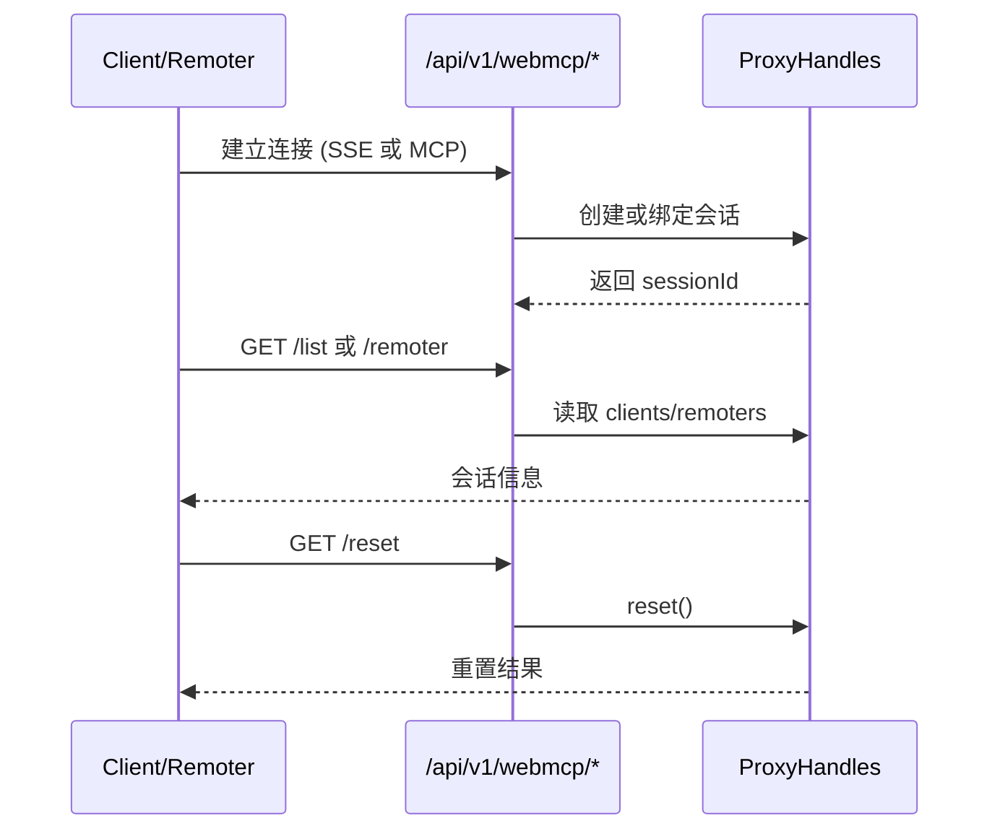

# 架构设计

本文档描述开源版 WebAgent 的核心架构、组件职责、数据流与扩展方式。

## 生态定位与关系

OpenTiny NEXT 是面向企业的智能化前端解决方案，目标是让传统 Web/桌面/移动应用能够被 AI/Agent 通过自然语言驱动与操作。WebAgent 是其中的“智能代理中枢”，负责承接 MCP 协议的连接与转发。NEXT-SDKs 则部署在业务应用内，用于把应用能力封装成 MCP 工具，并与 WebAgent 建立会话连接。[Opentiny 官网](https://opentiny.design/) [一场 MCP 生态的变革——详解 OpenTiny NEXT 逆向思维的技术创新](https://mp.weixin.qq.com/s/xMx5sfKGh2R-oZPGUwv70A)

关系可以理解为：

- 业务应用内：使用 `@opentiny/next-sdk` 的 `WebMcpServer` 注册工具，使用 `WebMcpClient` 连接 WebAgent 获取 `sessionId`。
- 中枢层：WebAgent 提供 MCP 代理转发、Streamable HTTP/SSE 通道与会话管理能力。
- 交互层：可选的 `@opentiny/next-remoter`（TinyRemoter）提供“AI 遥控器/对话框”体验。

下图展示了 OpenTiny NEXT 生态中 WebAgent 与 NEXT-SDKs 的位置关系：


## 系统概览

WebAgent 采用分层架构：入口层（Server）负责进程级生命周期，应用层（Express App）负责安全与中间件，路由层负责功能端点编排，核心协议处理由 `@opentiny/agent` 提供。



## 组件详解

### 组件依赖图



### 1. 服务器层 (Server Layer)

**文件**: `src/server.ts`  
职责：

- 创建并初始化应用实例
- 绑定端口与主机
- 处理进程级信号（`SIGTERM`/`SIGINT`）并优雅关闭
- 启动完成后通知 PM2（`process.send('ready')`）

**关键函数**:

- `startServer()`

### 2. 应用层 (Application Layer)

**文件**: `src/app.ts`  
职责：

- 初始化 Express
- 安全与基础配置（`helmet`、`trust proxy`）
- 注册中间件与路由
- 注册错误处理（确保在路由之后）

**关键类/函数**:

- `class Application`
- `initialize()`
- `setupMiddleware()`
- `setupRoutes()`
- `setupErrorHandling()`

### 3. 中间件层 (Middleware Layer)

**目录**: `src/middleware/`  
职责：

- CORS 策略
- 请求 ID 生成
- 请求/响应日志
- 内容类型验证
- 统一错误处理

**核心中间件**:

- `corsMiddleware`：对 `/api/v1/webmcp/*` 无条件放行 CORS，其它路由走静态配置
- `requestIdMiddleware`：生成或透传 `X-Request-ID`
- `loggingMiddleware`：请求开始与结束日志
- `validationMiddleware`：限制 `POST/PUT/PATCH` 的 `Content-Type`
- `errorMiddleware`：统一错误响应，支持 `BaseError` 与验证错误

**关键设计点**:

- `setupMiddleware()` 会对 `/api/v1/webmcp/messages` 跳过 body parsing（流式消息转发场景）
- 错误处理中间件必须在路由之后注册

### 4. 路由层 (Routes Layer)

**目录**: `src/routes/`  
职责：

- 健康与诊断端点
- v1 API 分组
- MCP 相关端点编排

**路由入口**:

- `src/routes/index.ts`
- `src/routes/v1/index.ts`

**健康检查**:

- `GET /health`
- `GET /health/detailed`
- `GET /health/metrics`

**MCP 路由（v1）**: `src/routes/v1/webmcp.ts`  
依赖 `@opentiny/agent` 的 `useProxyHandles()`，封装多种传输模式：

- `GET /api/v1/webmcp/sse`：SSE 连接（Inspector/Proxy 模式）
- `POST /api/v1/webmcp/messages`：SSE 消息转发
- `ALL /api/v1/webmcp/mcp`：Streamable HTTP（标准/Inspector）
- `GET /api/v1/webmcp/list`：客户端会话列表
- `GET /api/v1/webmcp/remoter`：控制端会话列表
- `GET /api/v1/webmcp/reset`：重置会话
- `GET /api/v1/webmcp/tools`：查询工具列表
- `GET /api/v1/webmcp/client`：查询指定会话信息

### 5. 配置层 (Config Layer)

**目录**: `src/config/`  
职责：

- `APP_API_PREFIX` 与应用基础配置
- CORS 配置解析
- 日志配置解析

**关键配置**:

- `config.app`: `port`, `host`, `env`, `apiPrefix`
- `config.cors`: `origin`, `credentials`
- `loggerConfig`: 日志级别、格式、输出位置、脱敏策略

### 6. 日志系统 (Logging System)

**文件**: `src/Logger.ts`  
职责：

- 基于 `winston` 的多传输日志
- 生产环境 JSON 日志、开发环境可读格式
- 敏感字段脱敏
- 异常与未处理拒绝处理

**关键点**:

- `maskSensitiveData()` 对 `password/secret/token/key/authorization` 关键字段脱敏
- 支持文件与控制台输出
- `httpLogStream` 供 HTTP 日志接入

## 数据流

### 1. 请求处理流程



### 2. SSE 连接生命周期



### 3. 会话管理流程



## 设计决策

### 为什么选择 Express.js

- 生态成熟，适合组合中间件与多协议端点
- 与 Node.js 22+ 兼容性好
- 支持灵活的路由组织和错误处理中间件

### 中间件设计原则

- **顺序明确**：安全与解析在前，自定义中间件在后
- **可控解析**：对流式消息端点跳过 body parsing
- **统一追踪**：`requestId` 在日志与错误中贯穿
- **分层职责**：CORS、验证、日志、错误独立拆分

### 错误处理策略

- 路由内业务错误尽量分类并返回
- 全局 `errorMiddleware` 兜底
- 支持 `BaseError` 标准结构
- 开发环境输出栈信息，生产环境隐藏敏感细节

## 扩展指南

### 添加新路由

1. 在 `src/routes/v1/` 新建路由文件
2. 在 `src/routes/v1/index.ts` 中 `router.use('/your-route', yourRoutes)`
3. 如需公共前缀，使用 `config.app.apiPrefix`

示例：

```ts
// src/routes/v1/foo.ts
import { Router } from 'express';
const router = Router();
router.get('/', (_req, res) => res.json({ ok: true }));
export default router;
```

```ts
// src/routes/v1/index.ts
import fooRoutes from './foo';
router.use('/foo', fooRoutes);
```

### 添加新中间件

1. 在 `src/middleware/` 新建中间件
2. 在 `src/middleware/index.ts` 中按顺序注册
3. 若影响解析或安全策略，放在 `cors` 前或后要明确说明

示例：

```ts
// src/middleware/exampleMiddleware.ts
import { Request, Response, NextFunction } from 'express';
export const exampleMiddleware = (_req: Request, _res: Response, next: NextFunction) => next();
```

```ts
// src/middleware/index.ts
import { exampleMiddleware } from './exampleMiddleware';
app.use(exampleMiddleware);
```

### 配置扩展方法

1. 在 `src/config/index.ts` 扩展 `AppConfig`
2. 从环境变量读取并设置默认值
3. 在使用处通过 `config.xxx` 引用

示例：

```ts
// src/config/index.ts
interface AppConfig {
  feature: { enabled: boolean };
}

export const config: AppConfig = {
  // ...
  feature: { enabled: process.env.FEATURE_ENABLED === 'true' },
};
```

```ts
// 任意使用处
import { config } from '../config';
if (config.feature.enabled) {
  // feature logic
}
```
